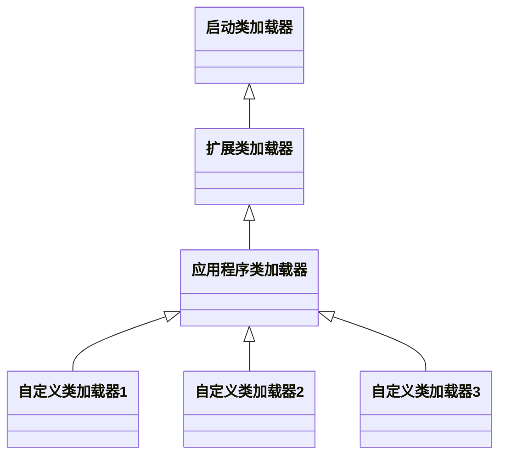
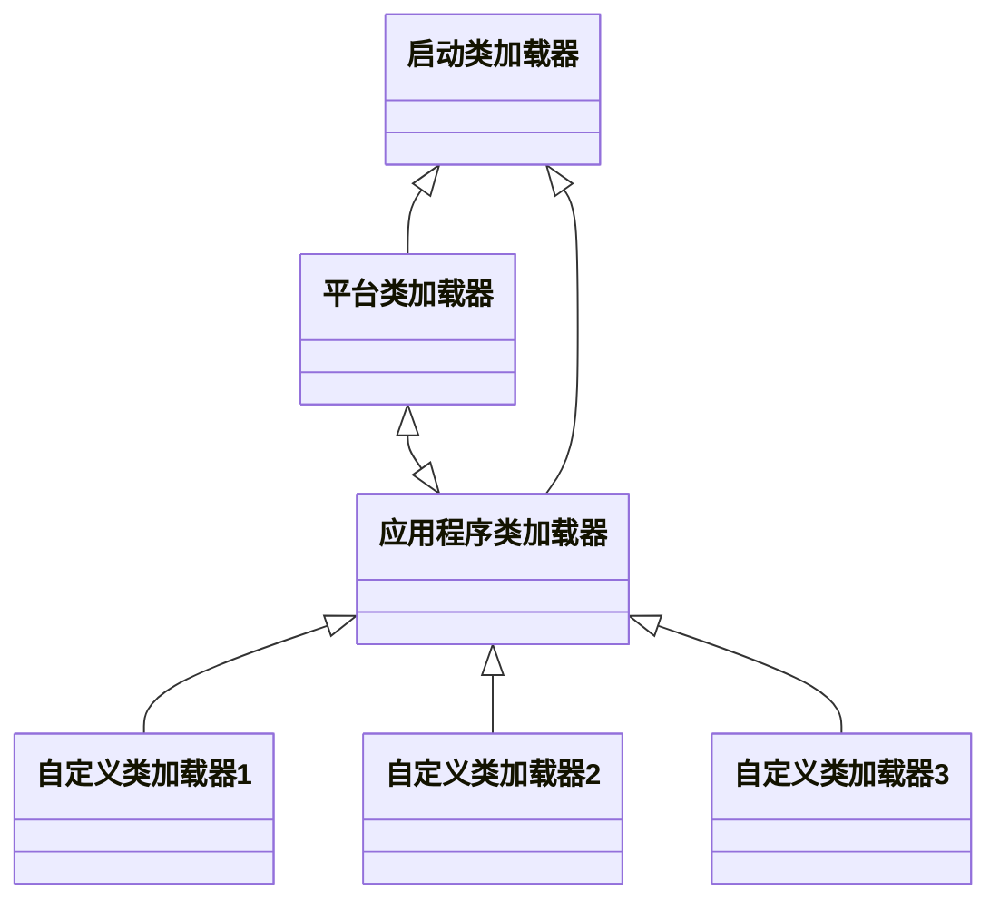

# 类加载

大概写一写JVM类加载机制，基本就是《深入理解Java虚拟机》这本书的一个笔记吧，顺便还参考了一波搜索到的一些内容

## 1. 时机

原则：

- **延迟加载、能不加载就不加载**
- 先父类后子类、先静态后非静态：
  - 例如如下顺序：父类静态、子类静态、父类非静态、父类构造函数、子类非静态、子类构造函数

## 过程

### 1. 类的生命周期

Class的生命周期包含**七个阶段**

其中：**加载、验证、准备、初始化、卸载**这五个阶段必须严格按照这个顺序依次**开始**（指的是开始顺序，执行过程可交叉进行）

解析阶段不一定。是为了支持运行时绑定（动态代理、Lambda表达式等特性的基础）

**类加载过程包含前五个阶段**

### 2. 类加载过程概要：

1. **加载**：

   - 三步：获取定义类的二进制字节流 -> 转换为方法区的运行时数据结构 -> 堆中生成Class对象作为该类相关的访问入口
   - 字节流可来源于class字节码文件、JAR等打包后的文件、甚至是网络。

2. **验证**：

   - 主要检查四部分：
     - 文件格式是否符合Class文件规范（各部分格式与内容）
     - 字节码语义是否符合语言规范（继承关系等检查）
     - 字节码的数据流控制流是否安全合法且符合逻辑（最复杂）
     - 符号引用是否正确匹配（访问权限等检查，*一般归为解析阶段*）

3. **准备**：

   简单说来就是**类静态变量分配内存并设置初始值**。相应的内容也存放在方法区。

   ***final修饰的赋值为指定的值，否则为对应类型的零值***

4. **解析**：

   将类的常量池中的<u>符号引用</u>（字面量表示的对象）变为<u>直接引用</u>（通过直接引用能找到这个字面量表示的对象）

   **在解析得到对应的目标后必定会进行访问权限检查**

   - 类、接口解析：将字面量（也就是类或接口的全限定名）交给类加载器加载，若是数组类型则递归地检查元素类型（是数组类型或其他的类型、类似广义表）
   - 字段解析：先解析该字段所属的类或接口。然后<u>依据类继承或接口实现树状关系，自底向上搜索，**先找接口后找类**</u>。
   - 类方法解析：仍然是先解析其所属的类，这里会先检查类，如果得到的是接口，则报错。然后依据类继承关系自底向上查找，*如果最终是在接口或父接口中找到，说明是抽象类，这时必定报错。*
   - 接口方法解析：和类方法解析类似。只不过检查得到所属的是类则会报错。然后自底向上查找，*如果最终在许多接口中都找到了对应方法，理论上是可以选择一个直接返回，但目前VM厂商基本都选择报错，防止出现问题*。

5. **初始化**：

   准备阶段已经对类变量分配内存了，但还没对值真正进行初始化（非final变量暂时放的都是零值）。这个阶段**相当于是执行类构造函数\<cinit\>()的过程**。

   > 类构造函数的一些注意点：
   >
   > - 编译器自动收集**静态变量赋值语句**以及**静态代码块**生成，按照书写顺序进行，在前的语句不能访问在后面声明的变量。如果没有可被收集的代码，可不生成类构造函数
   > - 无需显式调用父类的类构造函数，JVM保证父类这时候<u>必定已经调用完成</u>
   > - 多线程下只能有一个线程真正在执行这个函数，因此多线程环境下可能会有线程阻塞的问题。而且仅仅会执行一次

## 3.类加载器、双亲委派模型

类加载器用于**通过一个类的全限定名来获取对应类的二进制字节流**。

不同的类加载器有各自独立的类名称空间，也就是说，**两个类相等，不仅这两个类来自于同一个class文件，它们还必须是同一个类加载器加载的**

> equals方法、isInstance方法以及isAssignableFrom方法返回值也依据这一点

#### **三层类加载器+双亲委派模型（Java 2~Java 8）**

三层类加载器：

- 启动类加载器：加载`%JAVA_HOME%\lib`目录下的类库，仅按名字识别（如rt.jar等），**无法直接引用**

- 扩展类加载器：加载`%JAVA_HOME%\lib\ext`目录下的类库，可直接使用Java代码引用

- 应用程序类加载器：加载`%CLASSPATH%`目录下的类库，一般是用户指定的一些类库。**应用程序在未实现自定义的加载器的情况下使用的都是此加载器**

  > 应用程序类加载器使用时。当某个被依赖的类缺失，只有在这个类被加载、链接时才会报异常。

**双亲委派模型**：

​	<u>所有类加载器在收到类加载的请求时，首先不会自己尝试加载相应的类，而是委派给父加载器去完成（除了顶层的启动类加载器）。父加载器反馈无法完成时则自己尝试加载。</u>

​	这可保证安全，如自定义实现了一个Object类尝试进行加载，会报SecurityException。并且保证基础类库中的类永远只有一种（类相等判定为一种，这种意义上）

#### **模块化系统（Java 9~现在）**

模块（module）新增的包含内容：依赖模块列表、导出包列表（其他模块可使用）、开放包列表（其他模块可反射访问）、使用与提供的服务列表。

> 模块化封装后，可显式声明对其他模块的依赖，这在启动时便可检查出类缺失异常。（这仅在模块未被修改的情况下成立，如果删除某个类但并不更新导出包列表，那么使用此类的模块在启动时依旧检查不到错误）

模块化系统兼容传统的JAR包，**类库视作传统JAR包还是模块仅取决于所在路径是CLASSPATH还是MODULEPATH**，并规定了以下访问规则来兼容：

- JAR位于CLASSPATH时：所有JAR及资源文件视为**匿名模块**，所有CLASSPATH、MODULEPATH以及JDK系统模块均对其可见
- 模块位于MODULEPATH时：视为**命名模块**，只能访问到模块自己定义的依赖模块，JAR对其不可见
- JAR位于MODULEPATH时：视为**自动模块**，默认对所有模块可见，也导出自己所有的包

由于模块系统取代了原有的传统JAR包封装方式，因此三层类加载器中的<u>扩展类加载器</u>被<u>平台类加载器</u>取代，目前的类加载器体系如下

*mermaid插件渲染还有问题，这个图里的箭头都显示不出来*

目前严格来说已经不能算是双亲委派模型，**这三层类加载器各自负责一部分模块的加载，在委派给父加载器前，会先检查要加载的类能否归属到某个系统模块中，如果可以则优先使用对应模块的类加载器进行加载。**